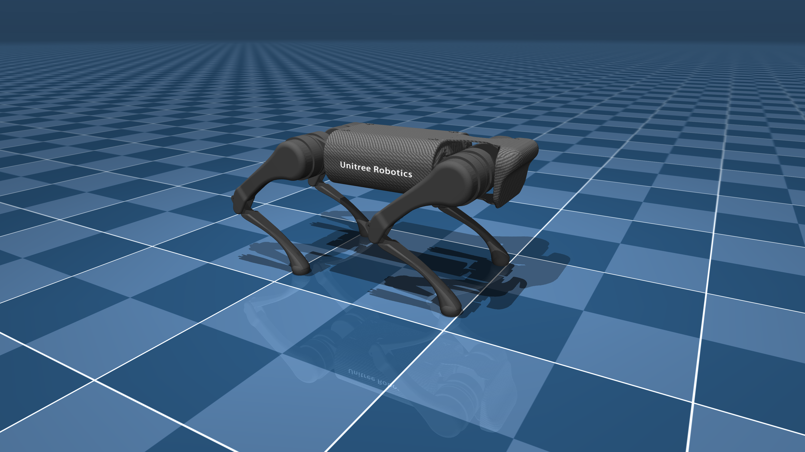

# Evolving Artificial Neural Network using Evolutionary Strategy for a virtual robotic control
## Overview
This project uses [Python-NEAT](https://github.com/CodeReclaimers/neat-python) to evlolve ANN(artificial neural network) to solve cart-pole balancing task and to control [Unitree A1 robot](https://github.com/deepmind/mujoco_menagerie/tree/main/unitree_a1) in [Mujoco physics simulator](https://github.com/deepmind/mujoco). 

[OpenAI Gym](https://www.gymlibrary.dev/) is together used with Mujoco to construct the custom reinforcement learning environment for robotic control task. 

For the robotic task, reward is given for the distance the robot travelled forward. However, reward is discounted by the action input size to encourage producing efficient robotic control. 



## Running the evolution
To run the evolution for cart-pole-balancing task:
```
python3 cart-pole.py
```
To run the evolution for robotic control task:
```
python3 main.py
```
To reconstruct/resume the evolution:
```
python3 checkpoint_vis.py PATH_TO_GENOME PATH_TO_CONFIG
```